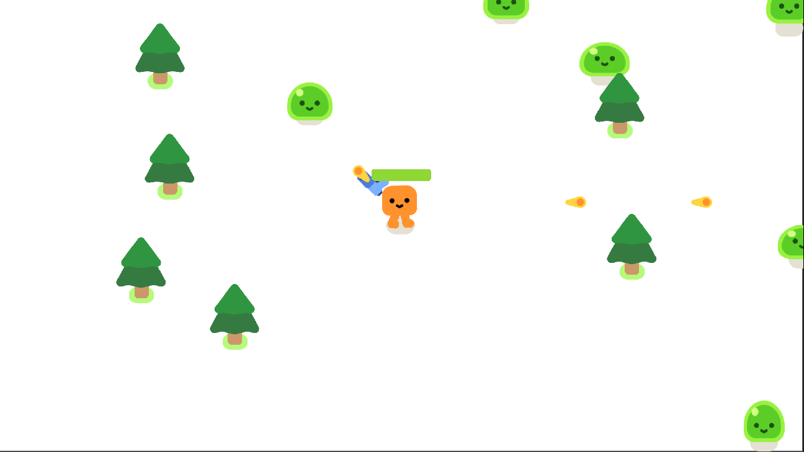

# VampireSurvivors

Um jogo de sobrevivência em tempo real desenvolvido com Godot.

## Descrição

VampireSurvivors é um jogo de ação e sobrevivência onde o jogador deve enfrentar hordas de vampiros e outras criaturas da noite. O objetivo é sobreviver o máximo de tempo possível, coletar upgrades e derrotar inimigos cada vez mais desafiadores.

## Funcionalidades Principais

- **Sobrevivência em Tempo Real**: Enfrente ondas intermináveis de inimigos.
- **Upgrades e Power-ups**: Colete power-ups para melhorar suas habilidades e armas.
- **Diversos Tipos de Inimigos**: Cada tipo de inimigo possui padrões de ataque únicos.
- **Gráficos Retro**: Estilo gráfico retrô que lembra os clássicos jogos de arcade.
- **Trilha Sonora Original**: Música envolvente que intensifica a experiência de jogo.

## Requisitos do Sistema

- **Sistema Operacional**: Windows, macOS, Linux
- **Processador**: Dual-core CPU
- **Memória**: 2 GB RAM
- **Gráficos**: Compatível com OpenGL 3.0
- **Armazenamento**: 200 MB de espaço disponível

## Instalação e Execução

### Clonando o Repositório

```bash
git clone https://github.com/bodescorp/GAME-vampireSurvivors.git
cd GAME-vampireSurvivors
```

### Rodando o Jogo

1. Baixe e instale o [Godot Engine](https://godotengine.org/download).
2. Abra o Godot e importe o projeto.
3. Clique em "Run" para iniciar o jogo.

## Screenshots



## Tecnologias Utilizadas

- **Godot Engine** - Motor de jogo utilizado para desenvolver o projeto.
- **GDScript** - Linguagem de script utilizada para programar a lógica do jogo.

## Autores

- **Glaymar A. de França** - *Desenvolvedor Principal* - [LINK](https://github.com/bodescorp)

## Licença

Este projeto está licenciado sob a Licença MIT - veja o arquivo [LICENSE](LICENSE) para detalhes.

## Agradecimentos

- **Godot Engine Community** - Pelos tutoriais e suporte.
- **GDQuest** - Pelo tutorial